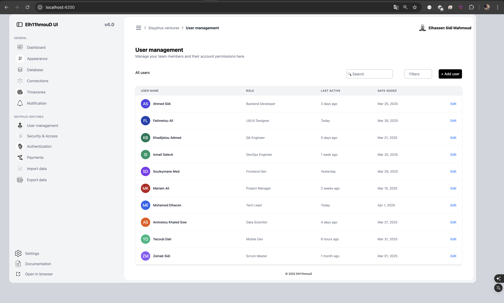

# Angular with Tailwind CSS Project

This project is an Angular application that uses Tailwind CSS for styling. It's built with Angular 18 and incorporates modern web development practices.



## 🚀 Features

- Angular 18
- Tailwind CSS 4.1.3
- TypeScript
- PostCSS
- Jasmine & Karma for testing

## 📋 Prerequisites

Before you begin, ensure you have the following installed:
- Node.js (v18.20.5 or higher)
- npm (Node Package Manager)
- Angular CLI (v18.2.11 or higher)

## 🛠️ Installation

1. Clone the repository:
```bash
git clone [your-repository-url]
cd tw4-angular
```

2. Install dependencies:
```bash
npm install
```

## 🚀 Development

To start the development server:

```bash
npm start
```

The application will be available at `http://localhost:4200/`.

## 📦 Build

To build the project for production:

```bash
npm run build
```

The build artifacts will be stored in the `dist/` directory.

## 🧪 Testing

Run the unit tests:

```bash
npm test
```

## 🎨 Styling

This project uses Tailwind CSS for styling. The configuration can be found in:
- `.postcssrc.json`
- `tailwind.config.js`

## 🔧 Project Structure

```
tw4-angular/
├── src/                    # Source files
├── public/                 # Static assets
├── .angular/              # Angular build files
├── .vscode/               # VS Code settings
├── node_modules/          # Dependencies
└── configuration files    # Various config files
```

## 📚 Dependencies

### Main Dependencies
- @angular/* (v18.2.0)
- tailwindcss (v4.1.3)
- postcss (v8.5.3)
- rxjs (v7.8.0)

### Dev Dependencies
- @angular/cli (v18.2.11)
- typescript (v5.5.2)
- jasmine & karma for testing

## 🤝 Contributing

1. Fork the repository
2. Create your feature branch (`git checkout -b feature/AmazingFeature`)
3. Commit your changes (`git commit -m 'Add some AmazingFeature'`)
4. Push to the branch (`git push origin feature/AmazingFeature`)
5. Open a Pull Request

## 📝 License

This project is licensed under the MIT License - see the LICENSE file for details.
